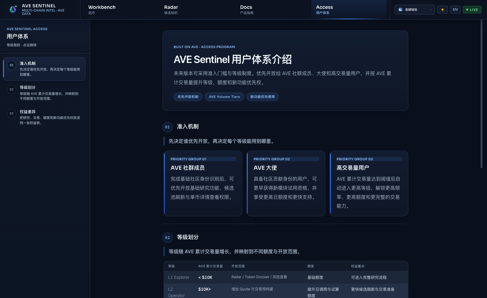

# AVE Sentinel

[简体中文](./README.md)

AVE Sentinel is an address-first multi-chain research and execution terminal built on AVE.

It is designed for fast, noisy, early-stage on-chain markets where traders need one practical answer:

**Given a contract address, is this worth doing, worth watching, or worth avoiding?**

AVE already provides the raw browsing layer for k-lines, holders, transactions, pairs, and risk reports.  
AVE Sentinel does not rebuild a heavier version of those native views. It focuses on the decision layer:

- `SENTINEL-8` scoring
- risk gates
- evidence explanation
- quote preparation
- execution readiness

## Public Preview



The image above shows the current Access Program page from the public build.  
It illustrates how AVE Sentinel can extend beyond research and execution into user access design, tiering, and privilege policy.

## Product Focus

- address-first token lookup
- unified multi-chain decision flow
- score, risk, evidence, and execution preparation in one path
- complementary positioning with AVE

## Workflow

1. Enter a contract address
2. Generate a `SENTINEL-8` score
3. Inspect the evidence page
4. Apply risk gates
5. Pull an official AVE quote
6. Prepare execution

## Paper

- [Read the paper PDF](./paper/main.pdf)

The paper explains the project background, product boundary, scoring design, and the complementary relationship between AVE and AVE Sentinel.

## Quick Start

```bash
npm install
npm run dev
```

## Environment

Required variables:

- `VITE_AVE_API_KEY`
- `AVE_API_SECRET`

## Note

The public GitHub version keeps only the core README, the English backup README, one product screenshot, and the paper PDF.  
Full internal documentation and submission materials remain in the private local working repository.
